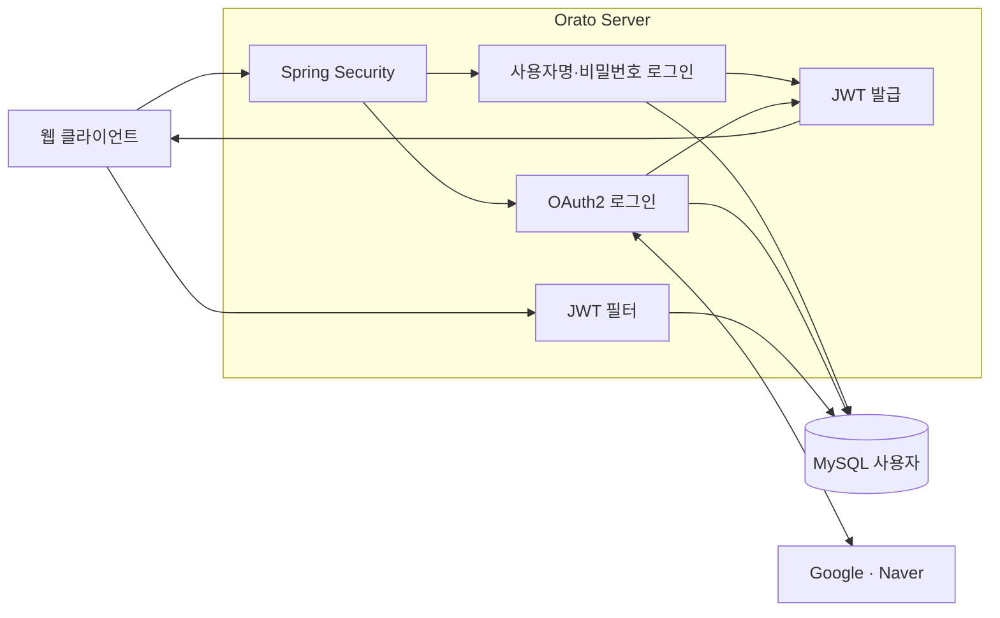
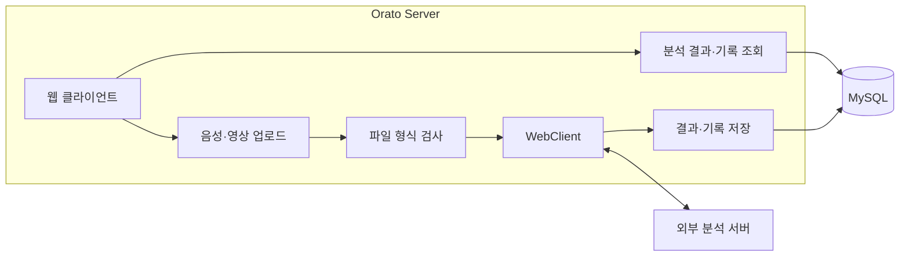

# Orato Server

Orato는 발표 음성·영상을 분석해 피드백과 발표 기록을 제공하는 서비스입니다. 이 Spring Boot 서버는 인증, 분석 요청, 기록 조회를 처리합니다.

Java 17 · Spring Boot 3.5.7 · Spring Security · Spring Data JPA · MySQL

## 아키텍처

### 인증



로컬 로그인은 비밀번호를 확인하고, 소셜 로그인은 Google·Naver 인증 결과로 사용자를 찾거나 생성합니다. 발급한 JWT는 `Authorization` 쿠키에 담아 전달합니다. 이후 요청의 JWT 필터는 토큰을 확인하고 DB에서 현재 사용자 정보를 조회합니다.

### 분석과 기록



업로드 파일은 확장자와 파일 앞부분을 검사한 뒤 분석 서버의 `/sound/analyze` 또는 `/video/analyze`로 전송합니다. 분석 응답을 받은 뒤 분석 결과와 `Record`를 한 트랜잭션으로 저장합니다. 결과와 기록 조회는 로그인한 사용자로 범위를 제한합니다. 분석 서버 요청 제한 시간의 기본값은 10분입니다.

## 실행

Java 17, MySQL, 분석 서버를 준비하고 아래 환경 변수를 설정하세요. Google·Naver 로그인 설정도 애플리케이션 시작 시 필요합니다.

```sh
export SPRING_DATASOURCE_URL='jdbc:mysql://localhost:3306/orato'
export SPRING_DATASOURCE_USERNAME='orato'
export SPRING_DATASOURCE_PASSWORD='<db-password>'
export SPRING_JWT_SECRET='<32-byte-or-longer-secret>'
export ORATO_ANALYSIS_BASE_URL='http://localhost:8000'

export SPRING_SECURITY_OAUTH2_CLIENT_REGISTRATION_GOOGLE_CLIENT_ID='<google-client-id>'
export SPRING_SECURITY_OAUTH2_CLIENT_REGISTRATION_GOOGLE_CLIENT_SECRET='<google-client-secret>'
export SPRING_SECURITY_OAUTH2_CLIENT_REGISTRATION_GOOGLE_REDIRECT_URI='<google-redirect-uri>'
export SPRING_SECURITY_OAUTH2_CLIENT_REGISTRATION_NAVER_CLIENT_ID='<naver-client-id>'
export SPRING_SECURITY_OAUTH2_CLIENT_REGISTRATION_NAVER_CLIENT_SECRET='<naver-client-secret>'
export SPRING_SECURITY_OAUTH2_CLIENT_REGISTRATION_NAVER_REDIRECT_URI='<naver-redirect-uri>'

# 로컬 HTTP 환경에서만 설정
export ORATO_AUTH_COOKIE_SECURE=false

./gradlew bootRun
```

서버는 기본 포트 `7999`를 사용합니다. `ORATO_FRONTEND_REDIRECT_URL`은 기본값 `http://localhost:5173/`이며, CORS 허용 출처와 OAuth 로그인 후 이동할 주소를 결정합니다. DB 스키마는 시작 시 `validate`로 검사하므로 먼저 준비해야 합니다.

## 주요 API

| 경로 | 용도 |
| --- | --- |
| `POST /auth/signup`, `POST /auth/login`, `POST /auth/logout` | 로컬 계정 인증 |
| `GET /oauth2/authorization/google`, `GET /oauth2/authorization/naver` | 소셜 로그인 시작 |
| `POST /analyze/sound`, `POST /analyze/video` | 음성·영상 파일 분석 |
| `GET /analyze/sound/{id}`, `GET /analyze/video/{id}` | 본인 분석 결과 조회 |
| `GET /records`, `GET /records/page` | 본인 분석 기록 조회 |

분석과 기록 API에는 JWT가 필요합니다. 서버는 `Authorization: Bearer <token>` 헤더 또는 `Authorization` 쿠키를 읽습니다. 쿠키로 변경 요청을 보낼 때는 프런트엔드 출처의 `Origin` 또는 `Referer` 헤더가 필요합니다. `/records`는 100건까지 반환하며, 그보다 많으면 `/records/page`를 사용하세요. API 명세는 `/swagger-ui/index.html`에서 볼 수 있습니다.
